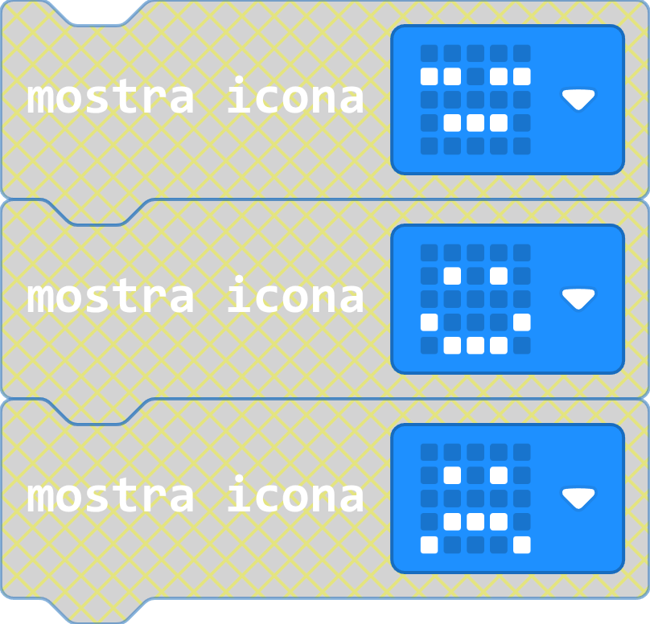
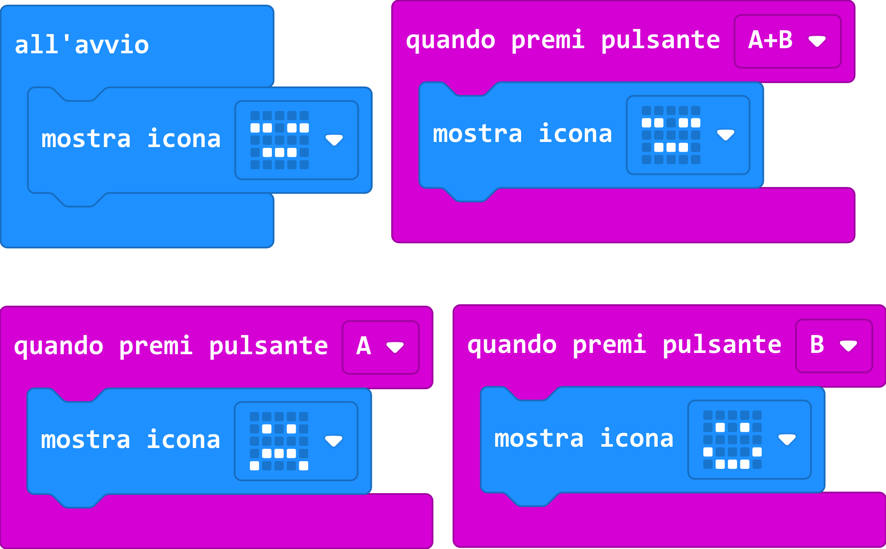
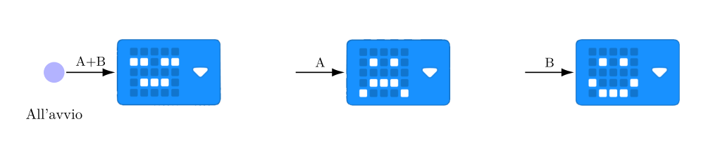
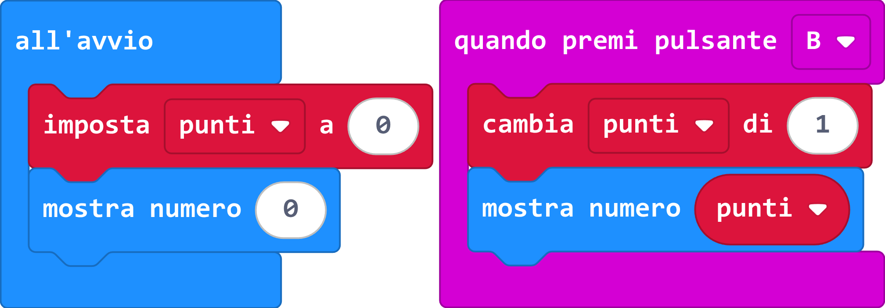
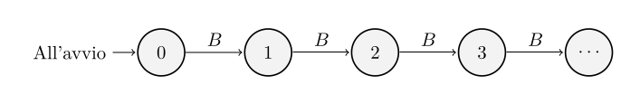
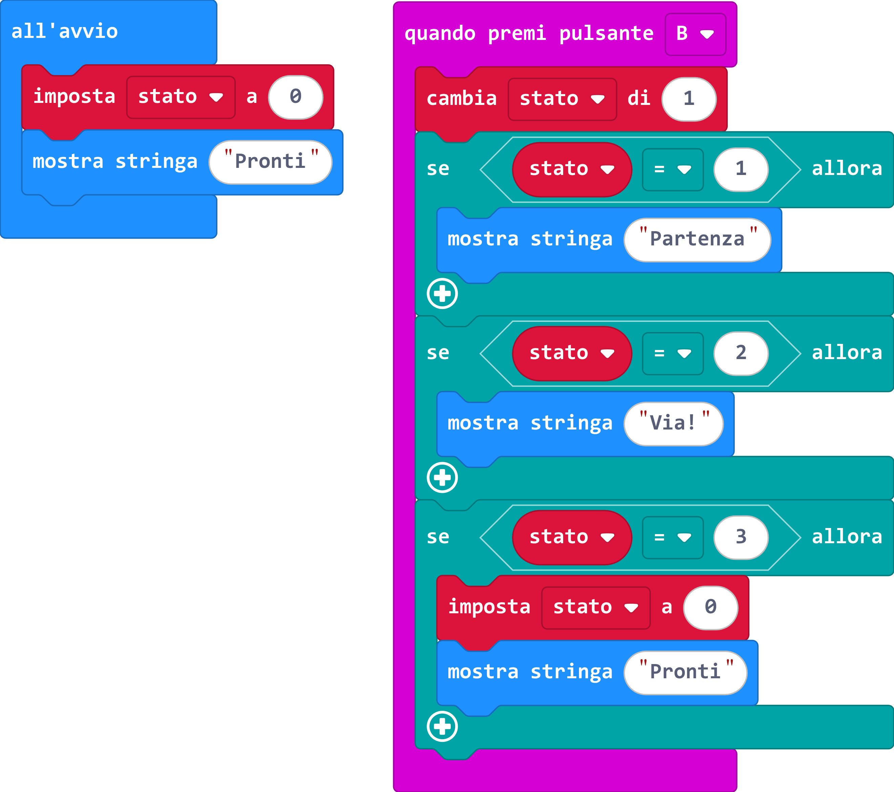
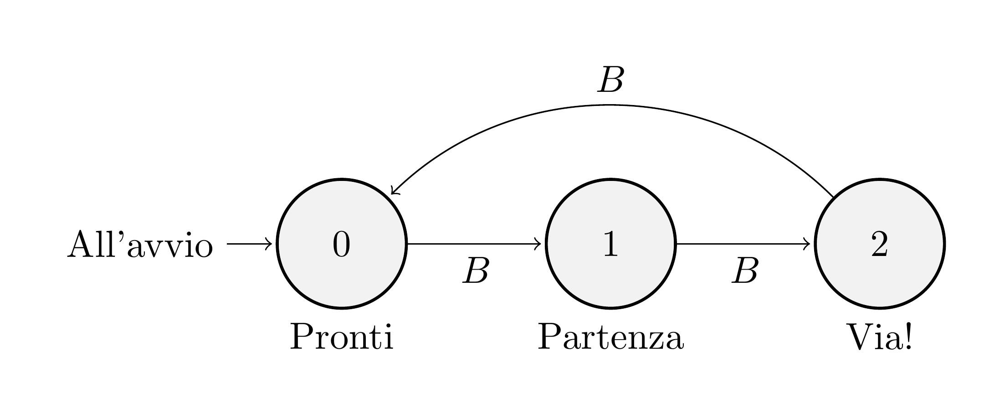
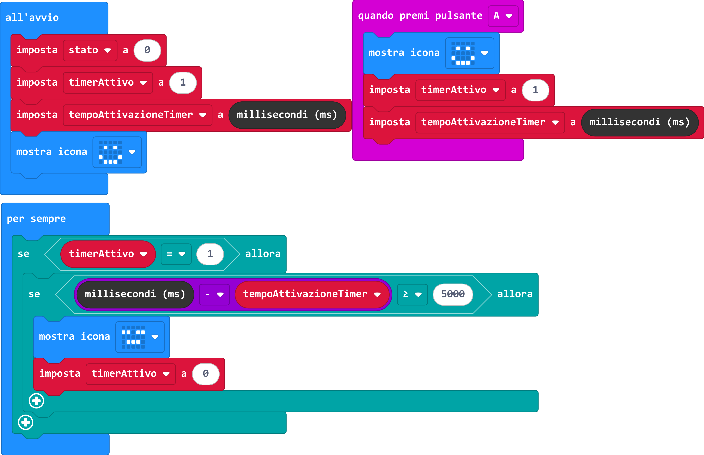
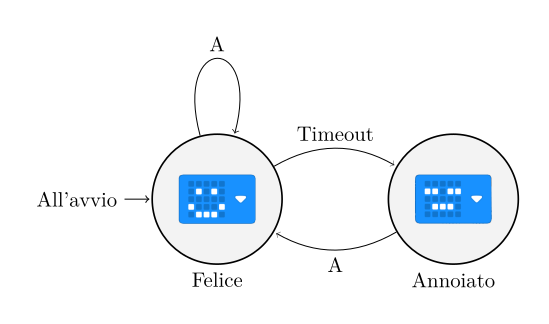

<Frontespizio
  :titolo="titolo"
  :sottotitolo="sottotitolo"
  :autori="autori"
  :url="url"
/>

<!--
Buon pomeriggio, sono Gionata Massi e presento, insieme al collega Emanuele Lorenzoni, un percorso di dieci ore realizzato all’Istituto Savoia Benincasa di Ancona. La proposta usa il physical computing, approcciato con una scheda Micro:bit, non come semplice occasione per “fare qualcosa con la tecnologia”, ma come un sistema concreto sul quale osservare e discutere idee fondamentali dell’informatica.

Il titolo sintetizza il movimento didattico: partire dall’interazione fisica, descrivere con precisione che cosa deve fare il dispositivo e arrivare a modellizzarne il comportamento. Il sottotitolo richiama perciò tre passaggi, non tre attività separate: fare, descrivere, modellizzare. Durante la presentazione seguirò questa progressione, poi discuterò che cosa abbiamo osservato e quali limiti sono emersi.
-->

---
layout: itadinfo
hideInToc: true
---

# Percorso della presentazione

<Toc maxDepth="2" minDepth="1" text-sm/>

<!--
Partirò dal contesto e dagli obiettivi disciplinari, perché aiutano a capire perché è stata scelta proprio la Micro:bit, e indicherò la grande idea dell'informatica attorno alla quale abbiamo progettato il percorso. Poi ricostruirò i cinque incontri seguendo la progressione dei concetti: dagli eventi e dagli output, alle variabili di stato, fino alle transizioni temporizzate. Chiuderò con gli strumenti di valutazione, i risultati del questionario e alcune criticità che suggeriscono come migliorare una futura edizione. L’attenzione sarà soprattutto su ciò che gli studenti erano chiamati a capire, non soltanto sui programmi che hanno realizzato.
-->

---
layout: itadinfo
---

# Introduzione
## Contesto e destinatari

<!-- ## Un percorso STEM nel primo biennio -->

- Progetto **“Citizen scientists of the future”**, PNRR – DM 65/2023
- IIS “Savoia Benincasa”, Ancona
- Classe seconda **ITE AFM**
- 10 ore: cinque incontri da due ore
- Nessuna competenza di programmazione richiesta

### Prerequisiti reali

- Leggere consegne operative
- Distinguere causa ed effetto
- Usare i numeri naturali per contare e misurare intervalli di tempo

<!--
L’esperienza si colloca nel progetto “Citizen scientists of the future”, finanziato nell’ambito del DM 65 del 2023 per il potenziamento delle competenze STEM. Il gruppo era una classe seconda dell’indirizzo Amministrazione, Finanza e Marketing dell’Istituto tecnico economico Savoia Benincasa. Il percorso occupava dieci ore, organizzate in cinque incontri di due ore.

Non era richiesta alcuna esperienza di programmazione. È una scelta importante: il punto di partenza non era saper già scrivere codice, ma possedere prerequisiti accessibili, come leggere una consegna operativa, riconoscere una relazione di causa ed effetto e usare i numeri naturali per contare o misurare intervalli. Questo rendeva possibile concentrarsi sulla costruzione di idee informatiche, invece che sulla selezione di studenti già esperti. (circa 1 minuto)
-->

---
layout: itadinfo
---

## Obiettivi
### Riferimento alle indicazioni CINI

<h3>Traguardi di competenza</h3>

<strong>T-S-6.</strong> Definisce, realizza e valida programmi e sistemi che modellano o simulano sistemi fisici o processi familiari del mondo reale o oggetto di studio nelle altre discipline.

<strong>T-S-10.</strong> Sceglie e riconosce nei programmi la rappresentazione dei dati dei problemi, dei risultati che ottiene e degli elementi utili a tener traccia degli stadi intermedi dell’elaborazione.

<h3>Obiettivi di apprendimento</h3>

<strong>O-S-P-1.</strong> Riconoscere come le varie parti di un programma contribuiscono al suo funzionamento.

<strong>O-S-P-2.</strong> Predire il risultato di un programma senza farlo eseguire.

<strong>O-S-P-4.</strong> Utilizzare cicli con condizioni per descrivere l’esecuzione di azioni parametriche.

<strong>O-S-N-1.</strong> Realizzare esperienze di raccolta ed analisi dati attraverso sensori e di controllo di dispositivi esterni.

<strong>O-S-D-1.</strong> Valutare vantaggi e svantaggi di rappresentazioni alternative della stessa informazione <em>(riferimento introduttivo)</em>.

<!--
Questa slide collega le attività a una lettura curricolare basata sulle Indicazioni CINI. Il traguardo T-S-6 riguarda la realizzazione e validazione di programmi che modellano sistemi o processi; T-S-10 porta l’attenzione su come il programma rappresenta i dati del problema, i risultati e gli stati intermedi.

Le attività su pulsanti, sensori e reazioni del dispositivo hanno permesso di lavorare su O-S-P-1, riconoscendo il contributo delle varie parti del programma. Il segnapunti e gli altri esempi con variabili hanno reso esplicita la rappresentazione dei dati e degli stadi intermedi. Il ciclo «per sempre» e le transizioni temporizzate del Tamagotchi hanno coinvolto O-S-P-4; l’uso della Micro:bit con sensori, pulsanti e display ha permesso di lavorare su O-S-N-1.

O-S-P-2 è stato affrontato in modo circoscritto, chiedendo di leggere blocchi già scritti e prevederne l’effetto osservabile. Il confronto fra blocchi MakeCode, stati numerici e diagrammi informali ha toccato O-S-D-1 solo in forma introduttiva: non va inteso come un obiettivo pienamente sviluppato o valutato. (circa 1 minuto e 30 secondi)
-->

---
layout: itadinfo
---

## Metodo e strumenti

### Una progressione di scoperta guidata
**Fare** → **descrivere** → **modellizzare**

- [Micro:bit](https://microbit.org/): pulsanti e sensori come ingressi; display LED come uscita
- [MakeCode](https://makecode.microbit.org/): linguaggio a blocchi, simulatore e caricamento sul dispositivo
- Dal comportamento osservato al programma, e dal programma al modello

### Cornice pedagogica

- Scoperta guidata attraverso progetti pratici
- Esempi iniziali da esplorare e generalizzare
- Macchina a stati come modello informale per progettare sistemi reattivi

<!--
La metodologia è una scoperta guidata organizzata per “ricette di progettazione”: si propone un comportamento, lo si osserva, si modifica il programma e si discute perché la modifica produce un certo effetto. La Micro:bit rende visibili le relazioni tra il programma e il mondo fisico: i pulsanti e i sensori forniscono ingressi, il display a LED produce uscite, mentre le variabili permettono di rappresentare informazioni che il sistema conserva.

MakeCode è stato scelto perché presenta un linguaggio a blocchi leggibile, dispone di un simulatore e permette di trasferire rapidamente il programma sul dispositivo. Il feedback è quindi immediato e concreto. La macchina a stati non è stata presentata come teoria formale completa, ma come modello informale sufficiente per progettare e discutere i comportamenti. (circa 1 minuto e 15 secondi)
-->

---
layout: itadinfo
---

## La grande idea: la macchina a stati

### Un comportamento si può descrivere

- **Eventi (ingressi):** pulsanti, sensori...
- **Transizioni:** eventi e condizioni determinano il passaggio da uno stato all’altro
- **Uscite osservabili:** azioni come mostrare o riprodurre
- **Stati:** configurazioni del sistema, rappresentate nel programma anche tramite variabili

**Modello informale**: abbastanza rigoroso da discutere il programma, senza introdurre tutta la teoria degli automi

Esempi MakeCode: <a href="https://gionata.github.io/interazione-fisica-e-pensiero-computazionale/microbit/microbit-recipe-1.hex">eventi</a> · <a href="https://gionata.github.io/interazione-fisica-e-pensiero-computazionale/microbit/microbit-recipe-2.hex">stato</a> · <a href="https://gionata.github.io/interazione-fisica-e-pensiero-computazionale/microbit/microbit-recipe-3.hex">ciclo</a> · <a href="https://gionata.github.io/interazione-fisica-e-pensiero-computazionale/microbit/microbit-recipe-4.hex">timer</a>

<!--
Prima di seguire gli incontri, introduco il modello che useremo come filo conduttore per leggerli. Un sistema ha stati, riceve eventi di input, effettua transizioni e produce uscite osservabili. Nel percorso gli eventi comprendono pulsanti e sensori; lo stato interno è rappresentato da variabili; il controllo si realizza con gestori di eventi, condizioni e, nei comportamenti temporizzati, con il ciclo «per sempre».

Non si tratta di presentare una teoria completa degli automi a stati finiti: il diagramma informale serve come strumento di progettazione e discussione, per chiarire il comportamento atteso e confrontarlo con i blocchi MakeCode. Nei prossimi esempi vedremo come questo modello si arricchisce progressivamente: prima l’evento e la risposta, poi la memoria dello stato, infine il controllo del tempo. (circa 1 minuto)
-->

---
layout: itadinfo
---

# La progressione didattica

| Incontro | Attività |
|---|---|
| 1 | Familiarizzazione con Micro:bit e tutorial introduttivi |
| 2 | Animale virtuale e transizioni guidate dagli input |
| 3 | Variabile di stato |
| 4 | Sequenze cicliche, codifica e ramificazioni |
| 5 | Mini-progetti, transizioni temporizzate, test e questionario |

### Dall’evento allo stato, dallo stato al tempo

<!--
La scansione in cinque incontri accompagna un cambiamento nel modo di pensare il programma. Il primo incontro è motivazionale e introduce la scheda attraverso tutorial; nel secondo si affronta l’animale virtuale e il legame tra input e transizioni. Nel terzo, con il segnapunti, diventa centrale l’idea che il programma conservi un valore interno. Il quarto introduce sequenze cicliche e codifiche numeriche; negli incontri successivi i mini-progetti applicano questi schemi e affrontano anche le transizioni temporizzate. La verifica e il questionario concludono il percorso.

Questa progressione è il filo che userò nei prossimi lucidi: in ogni fase cambia la domanda. Prima “che cosa accade quando premo?”, poi “in quale stato si trova il sistema?”, infine “che cosa deve controllare il programma perché il passaggio avvenga dopo un intervallo?”. (circa 50 secondi)
-->

---
layout: two-cols
---

## Incontro 1 — Familiarizzare con Micro:bit

- Conoscere il display LED e i pulsanti
- Esplorare i tutorial *Flashing Heart*, *Name Tag* e *Smiley Buttons*
- Osservare output visivi e testuali e primi input da pulsante
- Confrontare simulatore e dispositivo

**Domanda guida:** come cambia l’effetto osservabile quando modifico il programma?

**Attività:** personalizzare un tutorial a partire dal comportamento osservato

::right::

{width=60%}

<!--
Il primo incontro ha una funzione motivazionale e di familiarizzazione con la scheda. Gli studenti esplorano tutorial introduttivi come *Flashing Heart*, *Name Tag* e *Smiley Buttons*: osservano output visivi e testuali e sperimentano i primi input da pulsante. Il simulatore e la scheda rendono immediatamente osservabili gli effetti delle modifiche al programma. (circa 1 minuto)
-->

---
layout: two-cols
---

## Incontro 2 — Descrivere stati osservabili

- Rappresentare stati con comportamenti e icone riconoscibili
- Provare input diversi e osservare le transizioni
- Passare dalla sequenza di azioni a una descrizione del sistema

**Non solo “che cosa fa”: anche “in quale stato è?”**

**Domanda guida:** lo stato cambia anche senza un nuovo input?

**Attività:** Un primo tamagotchi

  

::right::

{width=100%}

<v-click>

### Macchina a stati

{width=100%}

</v-click>

<!--
Nel secondo incontro si introduce informalmente il concetto di automa e il diagramma di stato. L’animale virtuale cambia comportamento in risposta ai pulsanti: il diagramma mostra che le transizioni dipendono dagli input, non dallo stato precedente. Non viene proposta una trattazione formale completa; il modello aiuta a descrivere e progettare sistemi reattivi.

L’insegnante guida gli studenti a distinguere una lista di azioni da una descrizione del comportamento: si parte da una situazione iniziale, si verifica quale input arriva e si osserva la nuova situazione. La rappresentazione è ancora informale, ma prepara il terreno ai diagrammi di stato e rende più facile discutere il programma prima di entrare nel dettaglio dei blocchi. (circa 1 minuto)
-->

---
layout: two-cols
---

## Incontro 3 — Conservare informazione

- Il programma deve ricordare un valore tra un evento e il successivo
- La **variabile** rappresenta lo stato dell’elaborazione
- Distinguere
   - **Input:** pulsante
   - **Stato:** punteggio 
   - **Output:** valore mostrato

**Attività:** segnapunti; come estensione, punteggi di casa e ospiti o differenza reti

  

::right::

<v-click>

## Macchina a stati

{width=100%}

</v-click>

<!--
Il segnapunti introduce un passaggio concettuale decisivo. Se ogni pressione deve aggiornare un punteggio, il programma non può limitarsi a rispondere all’evento istantaneo: deve conservare informazione tra una pressione e la successiva. Questa memoria è rappresentata da una variabile.

È qui che si può discutere in modo concreto la distinzione fra input, stato e output. Il pulsante B fornisce l’input; il punteggio è un dato interno che cambia a ogni pressione; il display mostra l’output. Il diagramma rende visibile la successione dei valori di stato. In un’estensione gli studenti realizzano un segnapunti che permette di annullare un punto con il pulsante A; altri progetti registrano i punti di due squadre o la loro differenza. La variabile non è soltanto un nome nel codice: rappresenta un’informazione che il programma conserva e usa. (circa 1 minuto e 10 secondi)
-->

---
layout: two-cols
---

## Incontro 4 — Codificare e far evolvere gli stati

- Rappresentare gli stati con valori numerici
- Usare condizioni per scegliere l’azione successiva
- Esplorare una sequenza ciclica: “Pronti, partenza, via!”

**Una domanda di previsione:** se lo stato è **2** e si preme B, che cosa succede?

**Attività:** sperimentare l’operatore resto e progettare altre sequenze cicliche

  

::right::

{width=65%}

<v-click>

### Macchina a stati

{width=100%}

</v-click>

<!--
Nel quarto incontro la sequenza degli stati viene codificata con numeri e le condizioni selezionano il comportamento successivo. A ogni pressione di B, il valore dello stato determina la fase successiva della sequenza “Pronti, partenza, via!”; dopo “Via!” si torna a “Pronti”. Il diagramma rende esplicito il ciclo.

Il modulo compare nel ragionamento come strumento per realizzare una progressione ciclica, senza trattare la matematica separatamente dalla programmazione. Una buona domanda didattica è chiedere di prevedere che cosa accadrà prima di eseguire il programma. La previsione costringe a leggere il valore dello stato e la condizione, invece di affidarsi soltanto al feedback del simulatore. Si comincia così a verificare il modello mentale dell’esecuzione. (circa 1 minuto e 10 secondi)
-->

---
layout: two-cols
---

## Incontro 5 — Mini-progetti e gestione del tempo

- Applicare gli schemi a segnapunti, dadi con accelerometro e giochi via Bluetooth
- Nel Tamagotchi temporizzato, il pulsante A avvia il timer
- Senza ulteriori interazioni, il timeout porta dallo stato felice a quello annoiato
- Il blocco «per sempre» controlla il tempo trascorso e la condizione di timeout

### Il tempo non “succede” nel programma: va rappresentato e controllato

  

::right::

{width=75%}

<v-click>

## Macchina a stati

{width=80%}

</v-click>

<!--
Nei mini-progetti gli studenti applicano gli schemi già incontrati: per esempio, realizzano segnapunti, giochi di dadi con l’accelerometro, giochi tra dispositivi tramite Bluetooth e la morra cinese. Una variante del Tamagotchi introduce la gestione del tempo: alla pressione del pulsante A si attiva il timer e si memorizza l’istante iniziale.

Il blocco «per sempre» controlla se il timer è attivo e quanto tempo è trascorso; superata la soglia, il programma passa dallo stato felice a quello annoiato e disattiva il timer. La pressione di A riporta l’animale allo stato felice. Il tempo non è un evento magico: nel programma viene rappresentato e confrontato esplicitamente. (circa 1 minuto e 20 secondi)
-->

---
layout: itadinfo
---

# Valutazione e risultati osservati

## Test finale
Lettura dei blocchi · input, output e stato · «all’avvio» e «per sempre» · previsione delle transizioni · componenti della Micro:bit

## Questionario di gradimento
- Il corso è stato apprezzato, ma non è stato percepito come pienamente rispondente alle esigenze degli studenti
- Non si è realizzato l’atteso aumento delle iscrizioni all’indirizzo **Sistemi Informativi Aziendali (SIA)**

## Esito del test
- Prestazioni mediamente buone, in particolare su variabili, struttura dei programmi e diagrammi di stato
- Restano difficoltà nel distinguere formalmente input e output delle periferiche Micro:bit

<!--
La valutazione conclusiva comprendeva un test a scelta multipla e un questionario di gradimento. Il test riguardava blocchi di codice, input e output, automi a stati finiti e logica di programmazione. Le prestazioni sono state mediamente buone, soprattutto nell’uso delle variabili di stato, nella struttura dei programmi e nella lettura dei diagrammi. Sono emerse però difficoltà nel classificare formalmente le periferiche della Micro:bit come dispositivi di input o output. Non sono disponibili percentuali o distribuzioni dei punteggi.

Dal questionario emerge che il corso è stato apprezzato, ma non percepito come pienamente rispondente alle esigenze degli studenti. Non si è inoltre realizzato l’obiettivo orientativo atteso, cioè aumentare le iscrizioni al percorso Sistemi Informativi Aziendali. (circa 1 minuto e 20 secondi)
-->

---
layout: itadinfo
---

## Criticità
### Fare non significa ancora saper spiegare

- Le prestazioni al test sono state mediamente buone
- Più difficoltà nella classificazione formale delle periferiche come input o output
- La competenza pratica non sempre si accompagna a una spiegazione formale
- La gestione del tempo richiede variabili e controllo continuo, da consolidare

### Due piani da distinguere

**Gradimento:** il corso è stato apprezzato, ma non pienamente aderente alle esigenze percepite  
**Orientamento:** non si è ottenuto l’aumento atteso delle iscrizioni al SIA

<!--
Una criticità emersa è la distanza tra competenza operativa e concettuale. Le prestazioni al test sono state mediamente buone, ma resta da consolidare la classificazione delle periferiche come input o output. La gestione del Tamagotchi temporizzato richiede inoltre di coordinare variabili, tempo e controllo continuo: è un passaggio che merita ulteriore consolidamento.

Il corso è stato gradito, ma non è stato percepito come pienamente rispondente alle esigenze degli studenti. Sul piano orientativo, l’attività non ha prodotto l’aumento atteso delle iscrizioni al SIA. Coinvolgimento, comprensione concettuale e orientamento sono obiettivi collegati, ma non coincidono; l’orientamento va progettato esplicitamente e non può essere dato per acquisito come effetto automatico del laboratorio. (circa 1 minuto)
-->

---
layout: itadinfo
---

## Sviluppi per una nuova edizione

- Più tempo per consolidare i concetti: dieci ore bastano per introdurli, non per stabilizzarli
- Verbalizzare input, stato, output e transizioni durante le attività
- Chiedere di **prevedere prima di eseguire**
- Esercitare il passaggio diagramma → programma

<!--
Le proposte di sviluppo derivano direttamente dalle criticità osservate. Dieci ore sono sufficienti per un’introduzione significativa, ma non per consolidare tutti i concetti che l’attività mette in gioco. Servirebbe tempo aggiuntivo per distinguere con sicurezza evento esterno e stato interno, usare il lessico di sensore come input e display come output e trasformare diagrammi di stato in programmi.

Sul piano metodologico si possono inserire brevi momenti di verbalizzazione: prima di modificare il codice, gli studenti dichiarano qual è lo stato, quale evento si aspettano e quale uscita dovrebbero osservare. Un esercizio sistematico di previsione prima dell’esecuzione aiuterebbe a far emergere eventuali misconcezioni. Infine, se si vuole che il percorso abbia anche una funzione orientativa, il collegamento con le discipline e con i percorsi STEM va reso esplicito attraverso esempi e momenti di riflessione, non lasciato al solo entusiasmo dell’attività. (circa 1 minuto e 15 secondi)
-->

---
layout: itadinfo
---

## Conclusioni — Fare, descrivere, modellizzare

- La Micro:bit rende osservabile il legame tra programma e sistema fisico
- Eventi e variabili aprono la strada alla modellizzazione degli stati
- Il laboratorio acquista valore formativo quando il ragionamento viene esplicitato

### Non solo programmare un comportamento: imparare a descriverlo e a discuterlo

<!--
In conclusione, l’esperienza mostra che il physical computing può offrire un contesto efficace per insegnare informatica nel primo biennio. Il suo valore non sta soltanto nella possibilità di costruire oggetti interattivi, ma nel rendere osservabile il legame tra input, stato, controllo e output. La Micro:bit offre un supporto concreto per parlare di questi concetti e per mettere alla prova le descrizioni costruite dagli studenti.

La condizione è esplicitare il contenuto disciplinare: non limitarsi a far funzionare un programma, ma chiedere di descrivere il comportamento, rappresentare lo stato, prevedere le transizioni e discutere la correttezza. È questa la progressione evocata dal titolo: fare, descrivere, modellizzare. Grazie. (circa 45 secondi)
-->

---

<RetroFrontespizio
  titolo="Interazione Fisica e Pensiero Computazionale"
  sottotitolo="Fare, descrivere, modellizzare"
  :autori="[
    {
      nome: 'Gionata Massi',
      affiliazione: 'IIS &quot;Savoia Benincasa&quot;',
      citta: 'Ancona',
      presentatore: true,
    },
    {
      nome: 'Emanuele Lorenzoni',
      affiliazione: '',
      citta: '',
      presentatore: false,
    },
  ]"
/>
